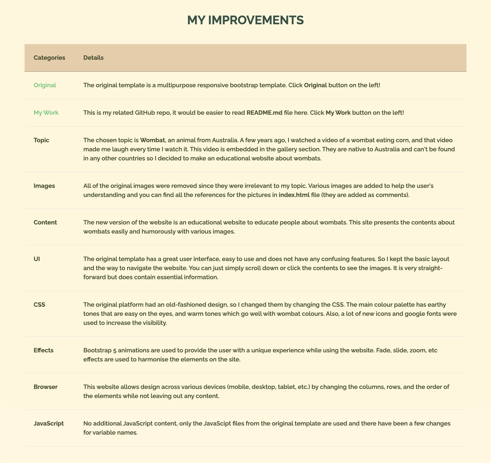
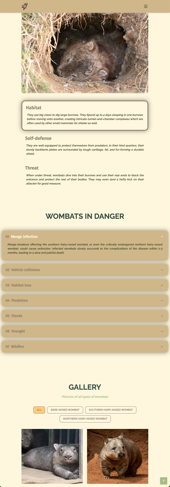

# EAD Lab 1 - Bootstrap Template
In the first lab you will have to reuse code downloaded from Bootstrap.
For this lab, you will need to have a bit of imagination and create a website on something
you like, and that other people will unlikely have a similar website.
- You could do a website on any specific topic such as cactus; hedgehogs; Elvis Presley;
a small town like Alquezar, Huesca (Spain); your favourite soccer player or group band;
a famous writer, movie director, or painter; or any other person/topic that catches your
eye.
- Avoid making a website of yourself or an imaginary company since that was last year
topic.
- Better to pick topics with which most people would be comfortable.
- Since this is not going to be published, you do not need to create the content and you
can use any content on the web instead. However, it is important to add references to
the pictures/texts you are using in your website.

 

To this end, follow the instructions:
1. You can download/copy any of the Bootstrap 5 Template from
https://themewagon.com/themes/ or any other repository that you like.
2. At this point you need to create a new website of your selected topic.
3. Here you have a nice tutorial for implementing bootstrap 5.
https://www.w3schools.com/bootstrap5/index.php

  

## Original Template
Link: https://themewagon.com/themes/free-one-page-multipurpose-responsive-bootstrap-template-download-2017/

 

Live Preview: https://themewagon.github.io/knight/ 

 

The Knight is an excellent starting free one page multipurpose responsive bootstrap template especially for business, landing page, portfolio, local business, personal websites and wherever you want. This is a powerful and versatile multipurpose template with pixel perfect design and outstanding functionality. It’s by far the most advanced template available today with loads of unmatched customization options. The use of Bootstrap brings a seamless, stunning, and appealing style which is easy to customize in such a way that’s most suitable for your upcoming project. The Knight is going to be much better than anything you’ve ever seen. It will present the best SEO results since the Bootstrapmade team optimized its structure perfectly.

  

## My solution

This is the home page of the website. As you can see, the wombat logo is located in the middle and the **Get to Know Me** button will bring you to the next page. 

  

Once you move onto the next page, there's a navigation bar at the top and it contains the wombat logo on the left and the list of navigation items on the right side. The About section contains 4 different lists, which will direct you to **What is a wombat?**, **Types of wombats**, **Life Cycle** and **Habitat and Self-Defence** sections respectively. This **What is Wombat?** section contains basic information about wombats. 

  

There's a map of wombat habitats and then we have a carousel describing each type of wombat with a short paragraph. 

  

Then we have **Life Cycle** and **Habitat and Self-Defense** sections with a tabbed interface. It's easy to navigate and you can just simply click the content to see the attached images.

  

The next section describes the wombats in danger using the accordion list, each of the list items appears sequentially when you scroll down the page. You can click to open the list content and click again to close the content, or click another item to close the current item and open another one.

  

To spice up the design, I added the gallery section with a bunch of images. Each button will sort the item according to their species and the play button on the image will bring you to the youtube video. 

  

This section contains fun facts about wombats. You can click the title to check the content. 

  

Then we have a donation section to help out the wombats in danger. 

  

I added my improvement by using the Bootstrap table. All of the changes that I made are described in this table.

  

This is one of the examples of responsive design, the contents are well displayed even though the browser size got reduced. 

  

Lastly, we have a footer to subscribe to the page and display the copyright and credit.
